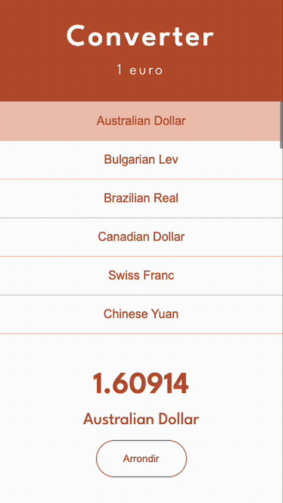

# oConverter

Crée une interface en `React` pour afficher une liste de devises 💪



## Étape 0 : prise en main

Installe les dépendances avec ton package manager préféré :
- `npm install` 
- ou `pnpm install`

Jete un oeil aux fichiers existants :
- `src/App.tsx` : contient le composant principal
- `src/App.css` : contient le code `CSS`
- `data/currencies.ts` : contient les données des différentes devises.

## Étape 1 : affichage de toutes les devises

Depuis le composant App, importe le tableau contenant les devises et avec map transforme le en un tableau d'elements JSX pour afficher les devises sur la page.

## Étape 2 : ajout d'un état pour la devise choisie

Créer un état pour stocker le choix de la devise de l'utilisateur : 
- la valeur initiale doit être la première de la liste des devises
- pense à bien nommer les variables en suivant les conventions
- pour l'instant, le setter n'est pas utilisé, mais ça ne saurait tarder !

Affiche ensuite les valeurs de la devise choisi dans le `<footer>` du composant, de sorte à ce qu'il reflète le futur choix de l'utilisateur. 

<details><summary>
Un peu d'aide ?
</summary>

```tsx
// Etat et setter
const [selectedCurrency, setSelectedCurrency] = useState(currencies[0]);

// Rendu
<footer>
  <div className="result__amount">{selectedCurrency.rate}</div>
</footer>
```

</details>

## Étape 3 : modification de l'état au clic sur une devise

Lors d'un clic sur l'une des devises de la liste, le `<footer>` doit maintenant s'actualiser avec les informations de la devise choisie par l'utilisateur.

<details><summary>
Un peu d'aide ?
</summary>

Ecoute le clic sur un `<button>` à l'aide de l'attribut `onClick={() => {}}` et utiliser le setter avec la valeur de la devise dans le callback fourni.

</details>

# BONUS

Bravo si tu as tout fini, tu peux passer aux bonus 💪

## BONUS 1 : ajout conditionnel d'une classe

Fais en sorte d'ajouter la classe `selected` sur le `<button>` qui a été sélectionné par l'utilisateur.

<details><summary>
Un peu d'aide ?
</summary>

```jsx
className={CONDITION ? "currency__button selected" : "currency__button"}
```

Reste à trouver la bonne condition !

</details>

## BONUS 2 : ajout d'un bouton pour arrondir

Ajoute et fait fonctionner un bouton pour arrondir le taux de la devise choisie à deux chiffres après la virgule.

<details><summary>
Un peu d'aide ? 
</summary>

- Créer un bouton "Arrondir" dans le `<footer>`
  - (avec une petite classe `result__button` par exemple)
- Lui ajouter un peu de CSS en s'inspirant du code SCSS des autres classes du footer.
  - (pas besoin que ça brille non plus, on s'inspire du screenshot plus haut)
- Créer un état pour stocker le choix d'arrondir ou non 
  - (un booléen par exemple)
- Au clic sur le bouton, changer la valeur de cet état 
  - (en son opposé par exemple)
- Selon la valeur de l'état, afficher le texte "Arrondir" ou "Désarrondir" sur le bouton
  - (ça clic et sa déclic !)
- Selon la valeur de l'état, arrondir le taux à deux chiffres après la virgule
  - (on pense à la méthode `toFixed(2)` des `number`, très pratique !)

</details>

<details><summary>
« J'ai la flemme d'écrire du CSS »
</summary>

Ouais je te reconnais bien là !

```scss
  .result__button {
    margin-top: 1rem;
    width: 120px;
    cursor: pointer;
    border: 1px solid var(--color-main);
    padding: 1rem;
    border-radius: 50px;

    background-color: var(--color-light);
    color: var(--color-main);
  }
  .result__button:hover {
    background-color: var(--color-main);
    color: var(--color-light);
  }
```

</details>

</details>
